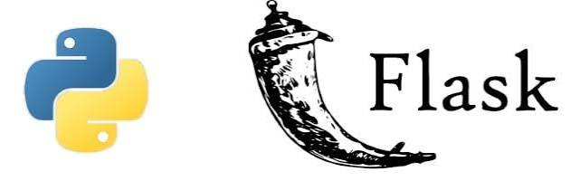
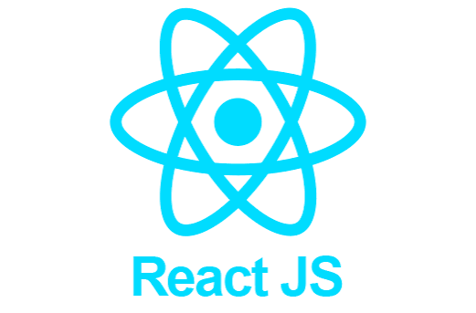

# Vertex AI Coach

An AI-powered fitness coaching platform: a gym coach (workout program, nutrition, supplements), a running coach (training log, adaptive training plans) and a GPS step counter.

**Live demo: [https://vertex-coach.netlify.app](https://vertex-coach.netlify.app)**

> The API runs on Render's free tier, which sleeps after 15 minutes of inactivity. The first request after a pause can take about a minute.

## Features

**Gym coach**
- AI-generated weekly program (workout split, nutrition, supplements) based on your goal, level and equipment, with an estimate of the time needed to see results
- Exercise images (wger.de) with a zoomable viewer, plus a YouTube video link per exercise
- Swap any exercise or supplement for an AI-suggested alternative; suggested supplement brands
- Save programs under a name (3 slots by default, adjustable per user by an admin) and browse them on a dedicated page
- Send a program to another user by email; recipients accept or decline it from an inbox and choose which saved program to replace when their slots are full

**Running coach**
- Training log (CRUD) with derived calories and estimated steps
- AI-generated adaptive training plans
- Dashboard with weekly volume and pace charts

**GPS step counter**
- Live tracking (start, pause, resume, finish) with distance from GPS, estimated steps and calories, and a route preview
- Session history and a dashboard with daily and weekly charts

**Platform**
- JWT authentication with user and admin roles, account suspension, self-service profile editing
- Admin panel: user management, statistics, and per-user views of running, gym and step data
- French / English interface, with AI-generated content translated on the fly
- Responsive layout, dark mode

## Repository structure (monorepo)

```
AI-Running-Coach/
├── api/         # Flask API: auth, activities, AI plans, gym coach, steps, admin
├── web/         # React + TypeScript application
├── render.yaml  # Render blueprint for the API
└── netlify.toml # Netlify build configuration for the frontend
```

## Tech stack

<p align="center">
  
  &nbsp;&nbsp;&nbsp;&nbsp;
  
</p>

- **API**: Python (Flask), JWT (`flask-jwt-extended`), BCrypt, MongoDB (`pymongo`), Groq API (free tier) for AI generation
- **Web**: React + TypeScript (Vite), Tailwind CSS, React Router, Recharts, Framer Motion, react-i18next
- **Database**: MongoDB Atlas
- **Deployment**: Render (`api/`, Docker + gunicorn) and Netlify (`web/`), continuous deployment on GitHub push

## Running locally

### API

```bash
cd api
python -m venv .venv
.venv/Scripts/activate  # Windows
cp .env.example .env    # then fill in MONGODB_URI, JWT_SECRET_KEY, GROQ_API_KEY
pip install -r requirements.txt
python run.py
```

### Web

```bash
cd web
cp .env.example .env  # VITE_API_URL
npm install
npm run dev
```

### Creating an admin account

No user is an admin by default. After creating an account through the interface, promote it:

```bash
cd api
python scripts/make_admin.py your-email@example.com
```

## Deployment

- **API (Render)**: create a Blueprint from this repository (it reads `render.yaml`) and set `MONGODB_URI`, `JWT_SECRET_KEY`, `GROQ_API_KEY` and `CORS_ORIGINS` (the frontend URL, without a trailing slash).
- **Web (Netlify)**: import the repository (it reads `netlify.toml`) and set `VITE_API_URL` to the API URL followed by `/api`. This value is baked in at build time, so redeploy after changing it.
- MongoDB Atlas must allow connections from Render (Network Access).
